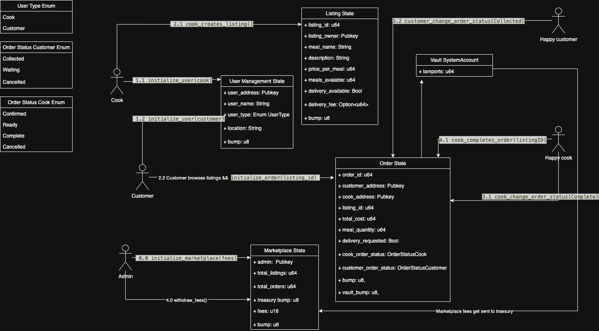

# Capstone - Decentralised Mealprep

## Introduction

A Solana-based meal prep platform that directly connects busy customers with local home cooks to provide access to genuinely traditional meals that corporate kitchens can't replicate, ensuring money flows directly to local communites rather than corporate stakeholders.

## How it works / Diagram

#### Marketplace initialisation

Firstly the admin initializes the marketplace, by selecting the fee-rate. The main account for this account that is also being created is the treasury account which will hold the lamports fees collected from the complete orders. The marketplace also keeps track of the number of all active listings and orders.

#### User initialisation

When potential customers comes to the dApp, we categorise them into two actors. Cook and Customer. When initializing a User account they specify their username, location and `UserType`.

#### Listing initialisation

Cooks then creates listing accounts, containing information like meal name, description, price per meal, meals available, delivery available, delivery fee etc.

#### Order initialisation

The customers browses these listings created by the cooks, and finds an appropriate one with the amount they wish to buy. They will initialize the order which takes listingID, and the portion amount. This will then create the Order account, sends the appropriate lamports to the vault account, from the customers wallet where the funds will be held, and the cook is notified of the newly created order.

#### Change Order Status

This is the section where the cook alongside the customer will update their order statuses according to what's going on with the order. Once the customer sets his `OrderStatus` to "Collected" and the cook has his set on the "Collected", then the cook will be able to withdraw funds from the vault.

#### Cook withdraws from vault and Marketplace fees get sent to treasury

Once the `OrderStatus` for both customer and cook is on their confirmed states. Then the cook will be able to withdraw their payment for the meal prep. In the function before sending the cook their lamports, we first take away the marketplace fee %, from the vault's total lamport balance. Then sending the fees to the marketplace treasury, while the rest gets sent to the cook.

#### Admin withdraws fees

Once the admin of the marketplace sees that enough orders have been completed. They can withdraw the lamport fees collected to their wallet.

## Tests

Overall there are 8 total tests that test 4 total accounts and their functionality, that being marketplace, user, listing and order.

1. In the user testing section, we are checking if the instantiation of the user accounts works correctly with the correct data in the `instantiateUser` passed like username, location and if the proper `UserType` is assigned to them correctly like cook or customer.

2. In the marketplace and listing section we checked if the instantiating of the marketplace account happened correctly and if the proper fees were placed with the `instantiateMarket`. We also create a listing account using the cook account, to check if proper data was saved such as meal name, amount of meals, price per meal with the `instantiateListing`.

- We also test the delisting of the listing, where we close the account and test if the rent gets sent back to the cook using the `closeListing` function.

- In the marketplace account, we also test the `withdrawFees` function that can only be called by the admin, to withdraw any  
  lamports thats been sent through completed orders. We first create and close and order successfully ensure that lamports was sent to both admin and cook, then call the `withdrawFees` function with the admin.

3. In the order tests, we first check if the instantiation of the order account was correct with the proper data using the `instantiateOrder`, and if it took the correct amount of lamports, and placed them in the vault from the customer account.

- Then we check the `changeOrderStatus` function on both customer and cook, to test if the  
  function works and if its updating the status correctly.

- Then we test the `closeOrder` function, it first checks to make sure that both the customer
  and the cook confirmed that they gave out and received the order. Once both parties have confirmed then the cook can close the order and part of the fee will be sent to the marketplace treasury and the rest of the lamports to the cook.

## Links

**Pitch Deck:** https://www.canva.com/design/DAGwKqh3lOA/Lxd0H-hc3_YvxlVIB7PT_w/edit?utm_content=DAGwKqh3lOA&utm_campaign=designshare&utm_medium=link2&utm_source=sharebutton

**Program Devnet Address:** https://solscan.io/account/7oCizVtCCp4VuFjWf4wbNzxpPckLZTSABP9YyBuD8oqa?cluster=devnet
